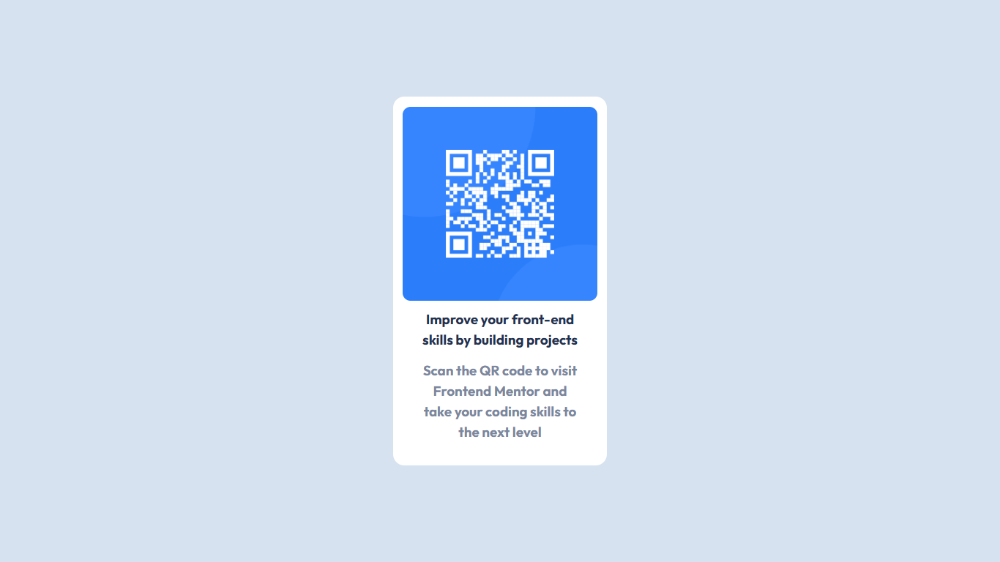

# Frontend Mentor - QR code component solution

This is a solution to the [QR code component challenge on Frontend Mentor](https://www.frontendmentor.io/challenges/qr-code-component-iux_sIO_H). Frontend Mentor challenges help you improve your coding skills by building realistic projects. 

## Table of contents

- [Overview](#overview)
  - [Screenshot](#screenshot)
  - [Links](#links)
- [My process](#my-process)
  - [Built with](#built-with)
  - [What I learned](#what-i-learned)
  - [Continued development](#continued-development)
  - [Useful resources](#useful-resources)
- [Author](#author)
- [Acknowledgments](#acknowledgments)

**Note: Delete this note and update the table of contents based on what sections you keep.**

## Overview

### Screenshot

### Links

- Solution URL: [Add solution URL here](https://your-solution-url.com)
- Live Site URL: [Add live site URL here](https://your-live-site-url.com)

## My process

### Built with

- Semantic HTML5 markup
- CSS custom properties
- Flexbox

### What I learned

For this first HTML/CSS mini-project I reinforced the basic fundamentals.

### Continued development

In the future I would like to complete more of these mini-projects to further strengthen my fundamentals. I also intend to learn more complex techniques and tools, allowing me to take on more advanced projects.

## Author

- Git Hub - [Vinicius Santos](https://github.com/viniciussnt)
- Frontend Mentor - [@viniciussnt](https://www.frontendmentor.io/profile/viniciussnt)
